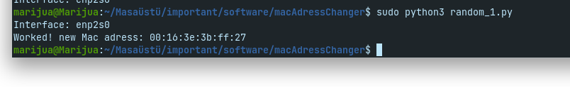

<h1>If you want to enter the mac address manually:</h1>
For using: 
sudo python app.py -i INTERFACE -m NEW_MAC_ADDRESS 
Example: 
sudo python app.py -i eth0 -m 00:11:22:33:44:55 
And your Mac Adress chang. New Mac Adress: "00:11:22:33:44:55" 
<h1>If you want the random mac address to be generated and changed:</h1>
For using: 
sudo python random_1.py 
output: "Write Interface:" 
Example: 

